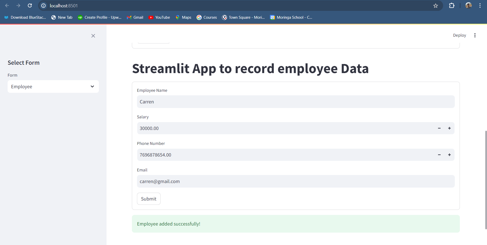
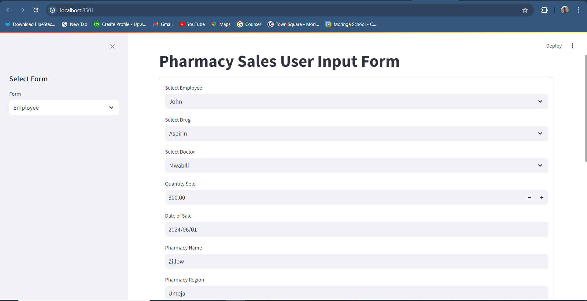
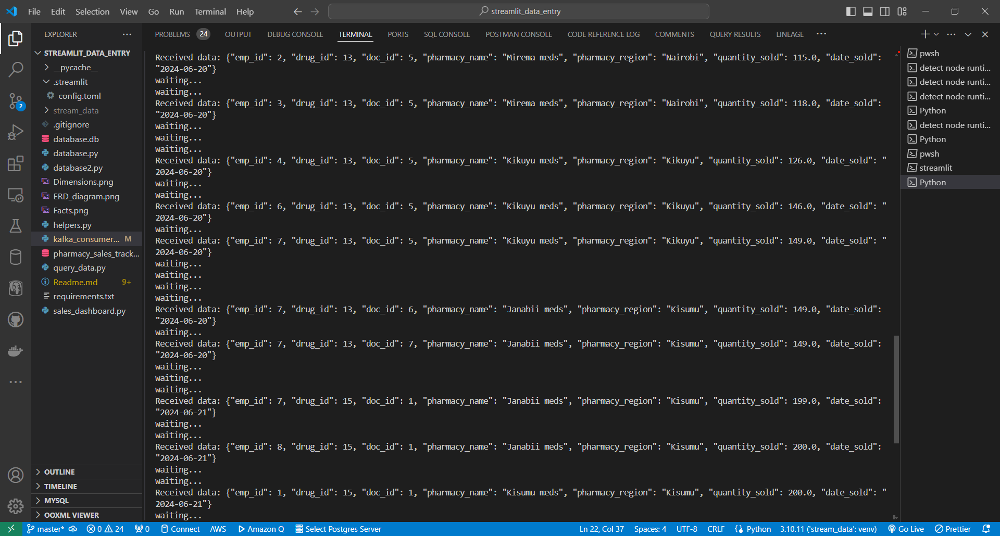

## 
<b><strong> Pharmacy Sales Tracker </strong></b> 
 

`Motivation:` With the ever rising need for automation and real-time tracking across sales organizations to minimize human error and identify fraud, I sought to develop a `Streamlit` application which uses `MySQL server` database and is intergrated with `Apache Kafka` which offers `Low latency` to ensures `real-time data streaming`.

### 
<b> Project Overview</b> 

Streamlit real-time Pharmacy sales tracker that uses the `star-schema` to track sales across several pharmacy outlets for a big pharma. The application leverages on using the `star-schema` which is:

* Easier to understand and manage
* Less dependant on table joins.
* High performance.

The application also uses the `MySQL server database` for data entry which  has several advantages namely:

* supports transactions.
* Supports data integrity.
* Handles severall transaction requests simultaneously.
* Offers atomicity. 

The application also intergates `Apache Kafka` for real-time data streaming as well as transformations. Using `Kafka` offers the following benefits namely:

* `Data durability and reliability` because data is stored on disk across brokers
* `Real-time data processing`
* Flexibility in `batch and stream processing.`
* `Data auditing and compliance`: With Change Data Capture (CDC) approaches, Kafka facilitates data replication across multiple systems or databases, ensuring accurate and consistent data for auditing and compliance purposes. 

### 
<b> Objectives & description</b> 

Develop a data model that follows the `star-schema` approach having the `dimensions` and `facts` table. The `table-models` can be found [here](pharmacy_sales_tracker.sql) which typically follows the `sql` approach. 

Defining the tables in a separate file offers a more flexible approach for the application suppose further change may arise. It also provides easy debugging for the application. 

`ERD-diagram` 

This [python-file](helpers.py) defines a class using the traditional `python OOP` approach which offers more customization and flavour to the main `streamlit application`.It also allows form sharing from the `doctor table`, `Employee table` and `Drug items` tables which are the `dimension tables` which very vital in providing more context to the `Facts table`. 

Intergrate `Apache Kafka` into the streamlit application to serve as the `Producer`. The data should be in `JSON` formart for easier ingestion into the `Kafka topics`. This is made possible by using the `serializer` which allows for transformation of data into `JSON` formart. 

Read data from `Kafka topics` by a consumer to allow for `Real-time` data streaming as well as processing. The consumer can be found [here](kafka_consumer.py)

To get started with `Apache Kafka`, the `Zookeper` should be running. On windows, the command to run the `Zookeeper` is `.\bin\windows\zookeeper-server-start.bat .\config\zookeeper.properties`. The `Kafka server` should also be running and is possible by uisng the command `.\bin\windows\kafka-server-start.bat .\config\server.properties`. 

N/B: Apache Kafka should be correctly configured in the environment variables to allow port communication.

### 
<b> Conclusion & Future steps</b> 

The `Sreamlit app` is deployed locally due to the constraints of the database being available locally and `Apache Kafka` port usage. Here is a snippet of the `User Interface` for inputting sales data to provide real-time tracking. 

After running the `Consumer`, here is a snapshot of how the data streams in from the streamlit application 

