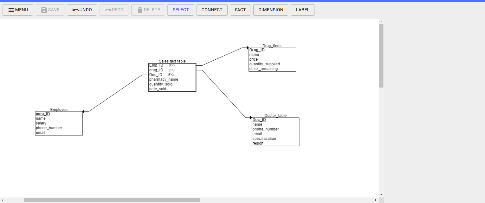

## 
<b><strong> Pharmacy Sales Tracker </strong></b> 
 

`Motivation:` With the ever rising need for automation across sales organizations to minimize human error, I sought to develop a `Streamlit` application which uses an `OLTP` database namely `SQLITE3` which has `Low latency` which ensures `real-time updates`.

### 
<b> Project Overview</b> 

Pharmacy sales tracker Streamlit application that uses the `star-schema` to track sales across several pharmacy outlets for a big pharma. The application leverages on using the `star-schema` which is:

* Easier to understand and manage
* Less dependant on table joins.
* High performance.

The application also uses the `SQLite3 OLTP database` for data entry which  has several advantages namely:

* supports transactions.
* Supports data integrity.
* Handles severall transaction requests simultaneously.
* Offers atomicity. 

### 
<b> Objectives & description</b> 

Develop a data model that follows the `star-schema` approach having the `dimensions` and `facts` table. The `table-models` can be found [here](pharmacy_sales_tracker.sql) which typically uses the `sql` approach. 

Defining the tables in a separate file offers more control to the application. It also provides easy debugging for the application. 

`ERD-diagram` 

This [python-file](helpers.py) defines a class using the traditional `python OOP` approach which offers more customization and flavour to the main `streamlit application`.It also allows form sharing from the `doctor table`, `Employee table` and `Drug items` tables which are the `dimension tables` which very vital in providing more context to the `Facts table`. 

